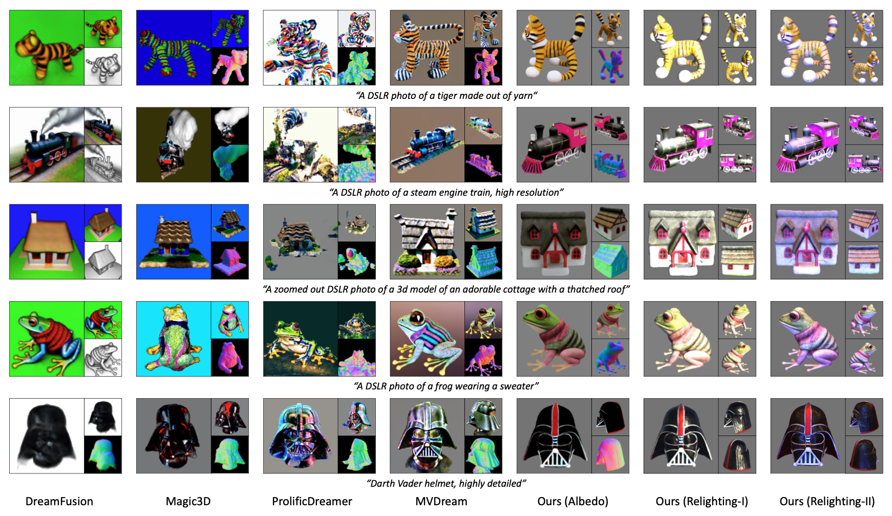
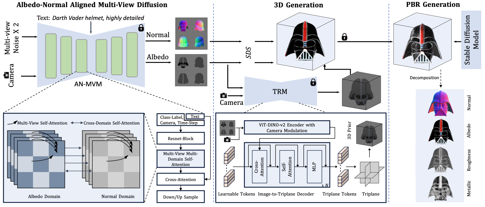

# UniDream
[Arxiv23] UniDream: Unifying Diffusion Priors for Relightable Text-to-3D Generation
## 🏠 <a href="https://yg256li.github.io/UniDream/" target="_blank">Project Page</a> | <a href="https://arxiv.org/abs/2312.08754" target="_blank">Paper</a>

Abstract: Recent advancements in text-to-3D generation technology have significantly advanced the conversion of textual descriptions into imaginative well-geometrical and finely textured 3D objects. Despite these developments, a preva- lent limitation arises from the use of RGB data in diffusion or reconstruction models, which often results in models with inherent lighting and shadows effects that detract from their realism, thereby limiting their usability in applications that demand accurate relighting capabilities. To bridge this gap, we present UniDream, a text-to-3D generation framework by incorporating unified diffusion priors. Our approach consists of three main components: (1) a dual-phase train- ing process to get albedo-normal aligned multi-view diffu- sion and reconstruction models, (2) a progressive genera- tion procedure for geometry and albedo-textures based on Score Distillation Sample (SDS) using the trained recon- struction and diffusion models, and (3) an innovative appli- cation of SDS for finalizing PBR generation while keeping a fixed albedo based on Stable Diffusion model. Extensive evaluations demonstrate that UniDream surpasses existing methods in generating 3D objects with clearer albedo tex- tures, smoother surfaces, enhanced realism, and superior relighting capabilities.

## 🔨 Method Overview

## 🤝 Codebase
The codebase of UniDream is coming soon.